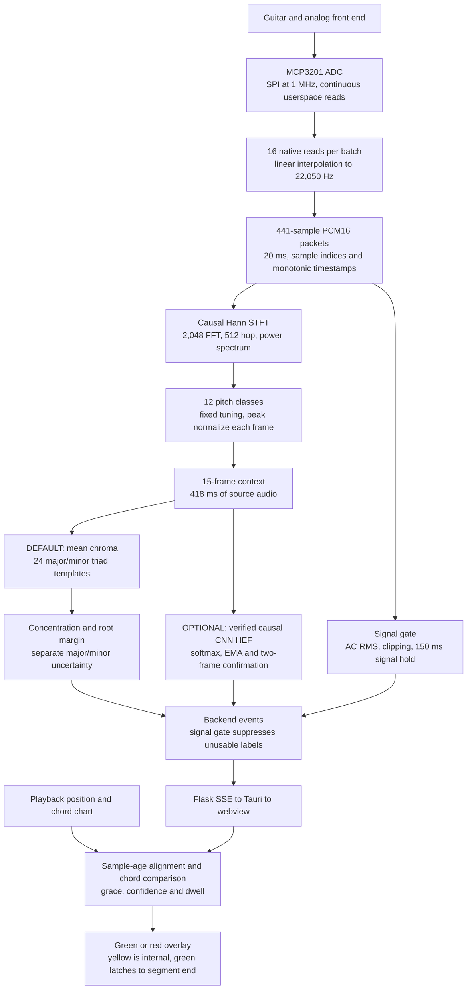

# Live feedback and chord processing audit

Audited October 3, 2026, against checkout `a972989` and the current working tree.

**October 5 update:** The `fft4096-context7` profile is now the template base: 4,096 FFT, 512 hop, seven chroma frames, and 325.08 ms of causal context. A new replay reproduced 947/948 exact guitar windows and green on all 24 synthetic segments. The CNN and its automatic template shadow retain the verified 2,048/15-frame contract. The analysis, diagram and baseline timing below describe the October 3 settings; see [template signal processing](template-signal-processing.md) for the current stages and [the run guide](dsp-template-experiment.md) for configuration.

The October 3 audit identified a **4,096-sample FFT with seven context frames** as the best next responsiveness experiment, while keeping the 22,050 Hz audio rate and UI thresholds. It improved recognition in the two saved guitar takes and the synthetic transition test, with a smaller total audio context than the previous default. Increasing the audio sample rate is not justified by the available evidence: native ADC throughput remains unverified under current playback load, and the largest known delays come from audio context and rating confirmation.

This audit traces the October 3 live path, distinguishes it from whole-recording chord mapping, and provides repeatable experiments. The October 3 audit left live defaults intact; the October 5 update promotes only the template FFT/context configuration. Signal thresholds, audio sampling rate and scoring policies remain unchanged.

## Scope and evidence

New measurements use the two September 28 guitar captures in `runtime/benchmarks`, with the existing approximate E, A, D, G and quiet **interior** annotations. Their transition times are not known precisely. A deterministic 48-second synthetic signal supplies 24 major/minor triads, harmonics, an attack/decay envelope, a DC offset, noise, and exact synthetic transitions. This signal exercises the pipeline but does not establish accuracy on guitars.

All new processing measurements are accelerated replay on this arm64 Mac. Packet delivery is simulated from chunk boundaries; real socket, Flask, Tauri, DAC, and rendering latency are excluded. The current production `FeedbackRater` supplies the rating results. There was no new physical Pi measurement in this audit. Historical Pi measurements below are explicitly identified by date.

Generated evidence is saved locally in `artifacts/live-feedback-audit-20261003/{summary,ratings,replay}.json`. That directory is ignored by Git. The scripts and this report are reproducible repository files. Windows from the same take overlap heavily; treat recordings and sessions as the independent evaluation units.

## October 3 live pipeline



The signal gate and feature extraction are distinct. DC centering currently affects the template's RMS measurement, **not the waveform passed to the FFT**. Quiet or clipped samples may still enter feature context before their output label is withheld. The optional CNN uses raw RMS for its signal gate, so the DC-offset problem remains on that route.

## How the DSP maps notes to chords

The extractor applies a periodic Hann window to each complete causal FFT frame, computes squared FFT magnitude, and projects the spectrum onto 12 pitch classes with librosa's chroma filter. Octaves are folded together: all C notes contribute to the C row. Each chroma frame is divided by its largest value, and the template recognizer averages the most recent 15 normalized frames. Fixed tuning is zero; there is no adaptive live tuning, explicit harmonic separation, bass-note tracker, or onset detector.

For each root `r`, major templates sum chroma at `r`, `r+4`, and `r+7`; minor templates use `r`, `r+3`, and `r+7`, modulo 12. The largest of the 24 sums wins. For example, C major scores C + E + G, while C minor scores C + E-flat + G. There is no learned model or Hailo inference in this default path.

The recognizer then measures:

| Evidence | Current rule | Interpretation |
| --- | --- | --- |
| Concentration | Winning triad sum / all chroma energy ≥ 0.40 | Enough pitch energy falls into the winning triad. |
| Root margin | Winning sum minus the best sum at another root ≥ 0.02 | The selected root beats competing roots. |
| Quality margin | Winning sum minus the opposite major/minor template ≥ 0.08 | Otherwise an exact UI match becomes internal yellow. |
| UI confidence adapter | `min(0.99, 0.5 + 5 × root_margin)` | A score adapter, not a probability. UI 0.60/0.70 correspond to root margins 0.02/0.04. |

This is efficient and interpretable, but octave folding discards inversion/bass information. Harmonics can add energy to notes that were not played. Shared tones create competing roots, and a weak third makes major/minor quality ambiguous. Peak normalization equalizes strong and weak frames; the separate input gate is essential. Template sums do not explicitly penalize missing chord tones or out-of-chord energy beyond the concentration test. Acceptance is therefore evidence of a favored template, not proof that all three notes were played.

Frequency resolution matters. At 22,050 Hz, FFT-bin spacing is 10.77 Hz for 2,048 samples, 21.53 Hz for 1,024, and 5.38 Hz for 4,096. The difference between low E and F is only about 4.90 Hz. Bin spacing is not a complete resolution bound, especially with a Hann window, but it explains why reducing FFT length can weaken low-note evidence. Upper harmonics also contribute to this recognizer. The filter and normalization behavior match [librosa 0.11 chroma STFT](https://librosa.org/doc/0.11.0/generated/librosa.feature.chroma_stft.html).

## Live recognition versus whole-recording mapping

These are separate pipelines. Changing the live template will not change the stored song chart or recording analysis.

| Use | Features and model | Temporal mapping | Audit consequence |
| --- | --- | --- | --- |
| Live feedback default | Causal STFT chroma and 24 fixed templates | Mean context, evidence gates, UI state machine | Can experiment without training or compiling a HEF. |
| Live feedback with `CHORDSENSE_LIVE_RECOGNIZER=cnn` | Same default causal features; 25-class CNN including Noise, verified HEF | Probability EMA α=0.45, entry 0.60 / exit 0.45, two-frame confirmation, then UI dwell | Feature changes require a compatible model and new verified export. Confidence calibration/generalization remain concerns. |
| Finished Record capture | Harmonic separation, whole-recording CQT chroma, custom CNN on Hailo | Centered nine-label voting, onset-based decisions, minimum 0.4-second chord segments, internal noise filling | Uses future context and cannot be substituted into the causal loop. Noise filling and onset snapping can hide brief mistakes. |
| Imported song analysis | Whole-song 288-bin hybrid CQT, 36 bins/octave from F-sharp 0, five pretrained CNN/LSTM models averaged | Structured chord evidence and XHMM dynamic-programming decoding | Broader chord chart vocabulary and future context; chart errors become feedback reference errors. |

The live CNN and whole-recording CNN have different feature contracts even though both use the same class vocabulary. The CNN loader verifies the live HEF hash, class order, numerical preprocessing metadata, and Pi verification flag. Historical tests in [the implementation record](live-feedback-implementation-plan.md) found substantial CNN errors across different recording takes; accelerator parity does not establish chord accuracy. Global pooling across pitch in the baseline CNN is a plausible contributor, not a demonstrated cause.

## October 3 baseline timing budget

| Stage or policy | Current value | Effect |
| --- | ---: | --- |
| Output audio rate | 22,050 samples/s | Separate from native conversion throughput and SPI bit clock. |
| Stream packet | 441 samples / 20 ms | Adds up to roughly one packet of delivery quantization. |
| Individual FFT span | 92.88 ms | Fundamental analysis window. |
| Feature hop | 23.22 ms / 43.07 frames/s | Rate of new prediction opportunities. |
| Full audio context after reset | `(2048 + 14 × 512) / 22050` = 417.96 ms | Earliest first prediction; simulated default first packet delivery is 420 ms. |
| Approximate context midpoint age | 208.98 ms | Chroma summarizes earlier audio although the event is timestamped at window end. |
| Template boundary grace | 120 ms | Prevents immediate grading at a chart boundary; does not remove old audio from the context. |
| Template positive/yellow dwell | 280 ms | Discrete prediction hops increase the actual confirmation interval. |
| Red dwell | 350 ms | More conservative wrong-root entry. |
| UI dropout hold | 240 ms | Applies before green has latched. |
| Template signal hold / reset | 150 ms / 1 second of detected silence | Avoids frequent context resets between strums. |
| Playback status poll | 250 ms | Position is extrapolated with `performance.now()` between polls; this is not a mandatory 250 ms overlay refresh delay. |

An ideal sustained match after a fresh reset needs at least about **698 ms** from audio context plus positive dwell, before processing and transport. The synthetic default first green appeared at **720 ms**. Continuous chord changes do not restart the extractor, so their delay differs from startup. The synthetic median transition-to-green was **600 ms** among the 21 of 24 segments that earned green; the other three must remain counted as failures to confirm.

The backend subtracts the within-packet sample offset from the packet's monotonic timestamp, records sample age, and the frontend adds bridge age before subtracting total age from playback position, scaled by playback speed. This correctly accounts for delivery delay under its clock assumptions. It does not measure analog/DAC latency or the historical extent of the feature window. Playback requests also anchor the returned position at response receipt, with no round-trip correction. Those residual offsets need on-device measurement, especially at chart boundaries. macOS local playback and a remote Pi backend would require clock-offset handling; the intended Pi path runs on one host.

## Sampling audit

The ADC driver sends one 16-clock SPI conversion at a time at a configured **1 MHz bit clock**. The acquisition thread reads continuously, groups 16 reads, estimates their timing from batch-end elapsed time, and linearly interpolates onto the 22,050 Hz output grid. The bit clock's ideal 62,500 conversion/s ceiling excludes chip-select and syscall overhead; it is not an achieved rate.

Historical September 28 output-stream evidence received 751 frames in 15.019 seconds, with no missing indices, 20.018 ms median packet capture interval, 21.472 ms p95, and 0.542 ms p95 receiver age. A separate historical SSE test reported 31.368 ms p95 total prediction age. These show the transport worked in those sessions. They do not prove evenly timed native conversions or performance under current playback load. Those older SSE events also used the then-existing raw-RMS gate; their signal-quality labels are not evidence for the current template gate.

The code and prior bench notes report native throughput around 45 kS/s at peak, with dips toward 15–20 kS/s under contention. These are historical observations, not new measurements. If native acquisition falls below the output rate, interpolated samples keep output time regular while information is lost. Batch timing assumes reads are evenly spaced; a scheduler stall violates that assumption. The resampler also contains no explicit anti-alias low-pass filter before reducing the rate. Analog anti-alias performance was not measured in this audit.

The daemon warns when an individual batch falls below 1.1 × the target rate, throttled to once every two seconds. It does not expose a throughput distribution, read-stall count, or interpolation deficit. Add those measurements before interpreting an output-rate probe as native sampling verification. The output probe added here deliberately reports `native_adc_rate_hz: null`.

Do not raise the SPI clock without checking actual ADC supply voltage and timing. Microchip specifies different rate/clock limits with supply voltage; the relevant reference is the [MCP3201 datasheet](https://ww1.microchip.com/downloads/en/devicedoc/21290f.pdf). The earlier recommendation of a turnkey “mcp320x + hrtimer + DMA” replacement was incorrect: the [upstream driver](https://github.com/torvalds/linux/blob/master/drivers/iio/adc/mcp320x.c) exposes direct reads and no triggered-buffer setup. A software hrtimer does not by itself provide hardware pacing or DMA. The affected comments and diagnostic guide have been corrected; a different deployed kernel may have additional support that must be checked.

## Replay experiments

All variants keep the audio rate at 22,050 Hz, template evidence thresholds fixed, and the current 280 ms positive dwell. “Exact” includes abstentions in the denominator. The guitar annotations cover eight selected chord intervals across two takes, excluding natural change boundaries. Synthetic latency percentiles include only segments that earned green, so coverage is reported alongside latency.

| Variant | FFT / hop / context | Warmup ms | Guitar exact / all windows | Guitar segments green / 8 | Synthetic segments green / 24 | Synthetic median / p95 green ms |
| --- | --- | ---: | ---: | ---: | ---: | ---: |
| Previous default | 2048 / 512 / 15 | 418.0 | 928 / 948 = 97.9% | 6 | 21 | 600 / 1060 |
| Nine frames | 2048 / 512 / 9 | 278.6 | 917 / 948 = 96.7% | 6 | 21 | 520 / 1100 |
| Seven frames | 2048 / 512 / 7 | 232.2 | 907 / 948 = 95.7% | 6 | 21 | 480 / 1020 |
| Smaller hop | 2048 / 256 / 15 | 255.4 | 1820 / 1894 = 96.1% | 6 | 21 | 460 / 940 |
| Approximately 10 ms packets | 2048 / 512 / 15 | 418.0 | 926 / 946 = 97.9% | 6 | 21 | 600 / 1045 |
| Smaller FFT | 1024 / 512 / 15 | 371.5 | 24 / 948 = 2.5% | 0 | 3 | 680 / 698 |
| New template base | 4096 / 512 / 7 | 325.1 | 947 / 948 = 99.9% | 7 | 24 | 500 / 560 |
| Stateful 20 Hz high-pass | 2048 / 512 / 15 | 418.0 | 948 / 948 = 100% | 6 | 21 | 600 / 1060 |

The 1,024 FFT variant accepted only 24 of 948 guitar windows; this was predominantly an abstention failure, rather than 924 wrong named chords. The baseline accepted 935 and got 928 right among them. The 4,096/seven-frame variant accepted 947, all correctly named. Its simulated first startup green was 640 ms, versus 720 ms for baseline. The larger FFT improves frequency resolution while the shorter context reduces total historical audio.

G remained quality-uncertain enough to prevent green in one of the two takes even with the promising variant. A correct raw root/triad name is not equivalent to a green rating. No named predictions appeared in the selected quiet intervals; these intervals were generally suppressed after the long-silence reset and therefore have no emitted prediction denominator.

Counterfactual charts compared each played segment with all 22 different-root major/minor alternatives. Both baseline and the promising variant produced zero false-green segments on the selected guitar interiors. **Baseline did produce one synthetic false-green segment: D-sharp major was accepted against a G-minor chart.** The high-pass variant added a C-sharp major versus F-minor false green. The 4,096/seven-frame variant produced none in this limited synthetic test. Counterfactual charts reuse the same audio; they are not independently recorded deliberate-wrong-chord trials.

Reducing positive dwell to 200 ms did not repair the three synthetic chords that failed to confirm under the default FFT, or remove its wrong-root false green. It sometimes allowed an additional recorded G interval to earn green. Keep this as a separate experiment; combining threshold and feature changes would obscure their effects.

Feature/filter/template computation on the Mac had approximately 0.06–0.15 ms p95 per processed chunk across these variants, excluding initialization, decoding, signal gating, transport and UI. A smaller hop roughly doubled prediction work. This local result favors investigating evidence-window length and grading policy before micro-optimizing the FFT, but it is not a Pi performance claim.

## Findings that affect correctness

| Priority | Finding | Evidence and recommended action |
| --- | --- | --- |
| High | Confirmed green represents a completed match for the segment, not ongoing correctness. | Existing tests explicitly preserve green through wrong chords, silence and missing predictions. The audit replay stays green after four seconds of reliable A against expected E. Choose this meaning deliberately; continuous feedback should clear or downgrade after sustained contradictory evidence or input loss. |
| High | Inconclusive input receives half credit. | `FeedbackScore` assigns 0.5 to yellow **and null**; a visited, wholly unrated segment scores 50%. Distinguish match accuracy from measurement coverage and exclude unobserved input from a correctness percentage. |
| High | Native sampling quality is hidden by output interpolation. | Output cadence cannot establish native throughput or jitter. Add native timing statistics and run known-tone and broadband checks under playback/inference load. Verify anti-alias filtering. |
| High for CNN mode | Its silence gate still uses raw RMS. | A DC-biased idle input can exceed 0.008 with no guitar signal. Template mode uses centered AC RMS; apply and validate an equivalent input-quality policy for the CNN without silently changing its trained features. |
| Medium | Feature evidence spans past audio but is aligned at the window end. | Current midpoint is approximately 209 ms old; grace is 120 ms. Measure boundary errors with exact change labels; consider onset-aware context reset or expected-chord evidence once validated. Do not blindly subtract the entire context from every timestamp. |
| Medium | Queues retain older work under overload. | IOD drops newest when its 16-frame queue is full, allowing roughly 320 ms of queued PCM. The 128-event backend deque is bounded FIFO, around three seconds at the default prediction rate. Prefer draining stale input/events to recent evidence, with explicit context reset on skipped PCM. |
| Medium | Feature contamination can outlast a clipping veto. | Clipped frames are still fed into context. Test recovery after clipping and suppress grading until enough clean evidence replaces them. |
| Medium | Root and chord quality are incomplete musical judgments. | Seventh chords get yellow for a matching root/triad; slash bass is ignored, and unsupported labels abstain. The score does not measure rhythm, fingering, inversion or a verified seventh. |
| Medium | The reference chart may be wrong. | Feedback compares live evidence to a separately generated chart. Validate chart errors separately from player errors, and test playback bleed on the physical ADC path. |

The guide's previous 500 ms template dwell description was stale; it has been corrected to the source's 280 ms positive dwell and 350 ms red dwell. Intentional latch and scoring semantics were left intact for review.

## Recommended next tests

1. **Measure sampling under the full application load.** Run the output probe with playback off/on and live inference off/on. Capture native-read rate percentiles and stall durations from an instrumented daemon. Verify low E, A4 and several higher known tones through the real capture path, then inspect frequency error, clipping and aliasing. The standalone SPI examples require the daemon stopped; running them concurrently would invalidate throughput measurements.
2. **Pilot 4,096 FFT and seven-frame context in template mode.** Keep the current 22,050 rate, 512 hop, packet size, evidence thresholds and UI dwell. Include correct chords, deliberate wrong roots and qualities, silence, clipping recovery, several voicings, detuning and another player/guitar. Measure per-session false-green/false-red time, time to green, abstention and CPU load. The CNN cannot use these features with its current verified HEF.
3. **Decide green and score semantics.** If green means “the chord remains correct,” test clearing after about 300–500 ms of reliable contrary input or sustained silence. If it means “this segment was achieved,” retain that behavior but report completion and observation coverage separately. These are proposed policy choices, not changes made here.
4. **Test packet size and high-pass separately.** Approximately 10 ms packets can reduce packet quantization but double transport traffic. A 20 Hz high-pass removed label errors on these two guitar interiors yet worsened one synthetic false-green case; it needs broader validation before adoption. Avoid the 1,024 FFT at current thresholds based on its acceptance collapse.

Report startup, sustained changes and recovery after reset separately. Report unconfirmed segments alongside latency percentiles. Suggested pilot goals are p95 stable green under 800 ms, less than 1% wrong-chord time green, less than 5% correct-chord time red, and explicit neutral input loss within 500 ms if continuous feedback is selected. These are proposed acceptance criteria, not achieved physical-device results.

## Reproduce the audit

From the repository's `backend` directory, using the existing working model environment on this Mac:

```bash
models/chord-cnn-lstm-model/venv/bin/python -m tools.audit_live_feedback \
  --output ../artifacts/live-feedback-audit-20261003
node ../frontend-tauri/frontend-tauri/src/feedback-audit.js \
  ../artifacts/live-feedback-audit-20261003/replay.json

models/chord-cnn-lstm-model/venv/bin/python -m unittest \
  models.chordsense_cnn.tests.test_template \
  models.chordsense_cnn.tests.test_streaming \
  models.chordsense_cnn.tests.test_inference_backends tools.test_live_feedback_audit
models/chord-cnn-lstm-model/venv/bin/python -m unittest discover \
  -s tests -p test_live_feedback.py
node --test ../frontend-tauri/frontend-tauri/src/feedback-rating.test.js
```

The October 5 validation passed **28 Python tests and 23 JavaScript tests**, including the CNN streaming/inference-backend checks. Regression checks cover gate parity for both contracts with DC-offset silence, first prediction and reset at 7,168 samples for the new base, preserved CNN/shadow settings, feature-contract rejection, and output-rate/loss accounting. The Mac's backend venv failed to import `scipy.signal`; the existing model venv was used successfully instead. No packages were installed or environment files changed.

The October 5 replay is saved locally in `artifacts/live-feedback-base-20261005`. The comparison labels the old default `baseline2048` and marks `fft4096-context7` with `is_live_default: true`. To run on a checkout without the untracked guitar recordings, add `--synthetic-only` to the audit command; the Node rater replay accepts those results too.

On the Pi, from `backend`, with recording capture inactive and a working backend Python environment:

```bash
venv/bin/python -m tools.probe_iod_stream --seconds 15 \
  --output ../runtime/benchmarks/iod-probe-current.json
venv/bin/python -m tools.probe_iod_stream --seconds 15 --frame-samples 221 \
  --output ../runtime/benchmarks/iod-probe-packet221.json
```

The probe closes only its own stream subscriber. It neither stops playback nor changes the daemon's sampling settings, and recording ownership remains enforced by IOD.

## Implementation references

- Acquisition and transport: [capture.rs](../iod/src/capture.rs), [spi.rs](../iod/src/spi.rs), [IodClient](../backend/iod_client.py).
- Live signal policy and events: [live_feedback_session.py](../backend/live_feedback_session.py).
- Features, templates and CNN filtering: [streaming.py](../backend/models/chordsense_cnn/streaming.py), [template.py](../backend/models/chordsense_cnn/template.py).
- Comparison and scoring: [feedback-rating.js](../frontend-tauri/frontend-tauri/src/feedback-rating.js).
- Clock, lifecycle and display: [play-along.js](../frontend-tauri/frontend-tauri/src/play-along.js), [feedback_bridge.rs](../frontend-tauri/frontend-tauri/src-tauri/src/feedback_bridge.rs).
- Replay and output sampling tools: [audit_live_feedback.py](../backend/tools/audit_live_feedback.py), [feedback-audit.js](../frontend-tauri/frontend-tauri/src/feedback-audit.js), [probe_iod_stream.py](../backend/tools/probe_iod_stream.py).
- Whole-recording mapping: [audio_processing.py](../backend/models/chordsense_cnn/audio_processing.py), [chord_recognition.py](../backend/models/chordsense_cnn/chord_recognition.py), [smoother.py](../backend/models/chordsense_cnn/smoother.py), [imported-song recognizer](../backend/models/chord-cnn-lstm-model/chord_recognition.py).
