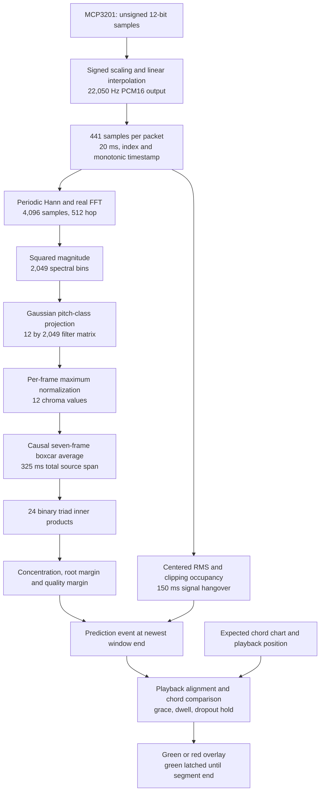

# Template signal processing

The default live recognizer is a causal STFT chromagram classifier followed by fixed triad-template scoring and a temporal grading state machine. Its base uses a 4,096-sample FFT, 512-sample hop and seven chroma frames at 22,050 Hz. The optional CNN and its automatic template shadow keep their separate 2,048 FFT / 15-frame contract.

The base is defined by `DEFAULT_TEMPLATE_PREPROCESSING_CONFIG` in [template.py](../backend/models/chordsense_cnn/template.py). Selecting another template configuration means passing a `PreprocessingConfig` to `StreamingTemplateRecognizer`; the live loader uses the base when no override is passed. The [run guide](dsp-template-experiment.md) describes recognizer selection, and the [audit](live-feedback-audit.md) compares eight configurations.

## Pipeline and data shapes

Signal-quality checks run alongside feature extraction. Short unusable periods may still enter feature history while their output labels are withheld. One second of detected silence triggers a context reset and suspends quiet-input processing until the signal returns.

## ADC scaling and sampling reconstruction

The [SPI driver](../iod/src/spi.rs) maps unsigned ADC code $a[n]$ to signed PCM16:

$$s[n]=16(a[n]-2048).$$

Python maps this to normalized floating point:

$$x[n]=s[n]/32768=(a[n]-2048)/2048.$$

The shift preserves the ADC's 12-bit resolution. The fixed midpoint does not estimate the actual analog offset, and there is no automatic gain control.

The [sampling loop](../iod/src/capture.rs) groups 16 native SPI reads. It estimates their spacing from batch-end elapsed time and uses piecewise-linear interpolation on a uniform $t_n=n/22050$ grid. Between adjacent estimated native samples:

$$y(t_n)=(1-\alpha)x_i+\alpha x_{i+1}.$$

Native timing within the batch is inferred. Scheduling stalls can violate the uniform-spacing assumption, and output interpolation can conceal a native acquisition deficit. There is no explicit bandlimited or polyphase resampler and no digital anti-alias filter in this loop. Output rate and native conversion throughput require separate measurements.

## Packet transport and signal quality

IOD sends 441-sample PCM16 packets with a first-sample index and monotonic availability timestamp. JSON/base64 is transport encoding. FFT frames use a continuous sample buffer and are independent of packet boundaries. Missing indices reset the extractor and chroma history instead of joining discontinuous audio.

The [live worker](../backend/live_feedback_session.py) computes packet mean and centered RMS:

$$\mu=\frac1M\sum_n x[n],\qquad R_{AC}=\sqrt{\frac1M\sum_n(x[n]-\mu)^2}.$$

Template input is active at $R_{AC}\ge0.008$, with a 150 ms signal hangover. Clipping occupancy is the fraction of samples with $|x[n]|\ge0.98$; occupancy of at least 0.05 vetoes the packet. The signal gate publishes an unusable chord as `null`.

Mean subtraction is used only to measure RMS. The FFT receives the original waveform, so this gate is not a DC blocker. Quiet or clipped samples can affect context before their output is suppressed. After one second of detected silence following the hangover, the template history resets; the next activity requires another complete causal context.

## Windowed power spectrum

Let $N=4096$ and $H=512$. The [extractor](../backend/models/chordsense_cnn/streaming.py) applies a periodic Hann window:

$$w[n]=\tfrac12(1-\cos(2\pi n/N)).$$

It computes a real FFT and squared magnitude:

$$X_m[k]=\sum_{n=0}^{N-1}x[mH+n]w[n]e^{-j2\pi kn/N},\qquad P_m[k]=|X_m[k]|^2.$$

There are $N/2+1=2049$ bins. Windows overlap by 87.5%. Each window spans 185.76 ms; each hop is 23.22 ms, giving 43.07 feature frames/s. Bin spacing is $f_s/N=5.38$ Hz. This is squared magnitude rather than a PSD calibrated by window energy. The following normalization removes common scale factors.

Frames are emitted only after all their samples arrive, with no centered padding or future-frame access. The periodic window is selected with `get_window("hann", N, fftbins=True)`; see [SciPy Hann](https://docs.scipy.org/doc/scipy/reference/generated/scipy.signal.windows.hann.html).

## Gaussian projection to chroma

The fixed filter matrix $W\in\mathbb R^{12\times2049}$ projects spectral power:

$$c_m[r]=\sum_k W[r,k]P_m[k].$$

Rows are pitch classes C through B. Logarithmic pitch position follows $p(f)=69+12\log_2(f/440)$, with distances wrapped modulo 12. Different octaves contribute to the same pitch class.

Librosa constructs Gaussian pitch-class weights whose widths accommodate low-frequency FFT-bin spacing, normalizes each FFT-bin column by its $L_2$ norm, and applies a Gaussian octave envelope. Defaults `ctroct=5` and `octwidth=2` center that envelope around $27.5\times2^5=880$ Hz. Fixed `tuning=0` anchors the bank to A440. See [filter parameters](https://librosa.org/doc/0.11.0/generated/librosa.filters.chroma.html) and [filter construction](https://librosa.org/doc/0.11.0/_modules/librosa/filters.html#chroma).

This is weighted octave folding of FFT power. It discards bass/register information and integrates harmonics according to their frequencies, without deciding which peaks are fundamentals. The DC column is nonzero; without waveform DC removal, offset and its windowed low-bin energy can affect chroma. CQT-specific configuration fields such as `fmin_hz` and `n_octaves` do not set the passband of this STFT projection.

## Frame normalization and temporal filtering

Each nonzero frame is maximum-normalized:

$$\tilde c_m[r]=c_m[r]/\max_q c_m[q].$$

This $L_\infty$ normalization reduces sensitivity to overall gain but discards absolute level. A weak noise frame can have the same maximum as a loud chord frame, making the independent signal gate essential.

The template averages the latest $L=7$ normalized frames:

$$\bar c_m[r]=\frac1L\sum_{\ell=0}^{L-1}\tilde c_{m-\ell}[r].$$

This is a causal boxcar FIR in the chroma domain, $B(z)=L^{-1}\sum_{\ell=0}^{L-1}z^{-\ell}$. It smooths transients but mixes old and new chord evidence during transitions. Normalization happens before averaging, so weak and strong frames receive equal temporal weight.

The total source span is $N+(L-1)H=7168$ samples, or 325.08 ms. The approximate evidence midpoint age is $(N/2+(L-1)H/2)/f_s=162.54$ ms. The boxcar is linear, but the preceding spectral-power and normalization stages make the complete classifier nonlinear.

## Triad scores and evidence gates

There are 24 binary templates: major and minor for each root $r$. Major templates contain $\{r,r+4,r+7\}$; minor templates contain $\{r,r+3,r+7\}$, modulo 12. Each score is $s_j=T_j^T\bar c_m$, and the largest score names the raw chord.

For example, chroma values C=0.9, E=0.8, G=0.7 and 0.02 elsewhere give C major 2.40, C minor 1.62 and A minor 1.72. Root is inferred from the whole pitch-class pattern, not identified as the lowest note. These sums do not require three individually detected fundamentals or explicitly penalize a missing chord tone; harmonics can support a template too.

The winner is accepted only if concentration $\gamma=s_{best}/\sum_r\bar c[r]\ge0.40$ and root margin $\Delta_r=s_{best}-\max_{root(j)\ne root(best)}s_j\ge0.02$. Otherwise the chord is `N`.

Quality margin compares the winner with the opposite quality at the same root: $\Delta_q=s_{best}-s_{opposite}$. Shared root and fifth cancel, leaving the difference between major-third and minor-third evidence. If $\Delta_q<0.08$, the chord remains named but is marked `quality_uncertain`. A strongly supported G/D pair with nearly equal B/B-flat evidence illustrates a clear root but uncertain quality.

The UI confidence adapter is $e=\min(0.99,0.5+5\Delta_r)$ for an accepted label, and zero otherwise. UI thresholds of 0.60 and 0.70 correspond to root margins 0.02 and 0.04. This value is relative evidence, not a posterior probability.

## Time alignment and temporal grading

Predictions are timestamped at the newest FFT window end. The worker derives that time from the enclosing packet timestamp by subtracting the remaining sample offset divided by $f_s$. Backend sample age plus frontend bridge age gives the comparison time $t_{chart}=t_{playback,now}-v\,t_{age}$ at playback speed $v$. Alignment corrects delivery age; it does not independently calibrate DAC/input latency or subtract the historical midpoint of the features.

The [rater](../frontend-tauri/frontend-tauri/src/feedback-rating.js) compares supported root and quality with the chart. Exact major/minor matches propose green; same-root quality differences or unverified sevenths propose yellow; different roots propose red. Unsupported labels, `N`, and unusable input abstain. Template quality uncertainty downgrades a proposed green to yellow.

The state machine applies 120 ms boundary grace, 280 ms positive/yellow dwell, 350 ms red dwell, and confidence-adapter floors of 0.60 and 0.70 respectively. A 240 ms dropout hold can preserve a pending candidate through a short unusable gap without counting that gap as evidence. Rating changes also have a 300 ms minimum display interval. Events older than 750 ms, from previous sessions, or belonging to a different current chart segment are rejected before new evidence is used.

Confirmed green is latched through the segment and is cleared by its boundary or an explicit lifecycle reset. Green and red have visible overlays; yellow is internal. The separate segment score awards one point for green, zero for red and half credit for yellow or a visited segment that remains unrated; it is not weighted by duration or observation coverage.

## Why this base was selected

| Contract | FFT bin spacing | FFT span | Total source span |
| --- | ---: | ---: | ---: |
| Previous template and verified CNN: 2048 / 512 / 15 | 10.77 Hz | 92.88 ms | 417.96 ms |
| Template base: 4096 / 512 / 7 | 5.38 Hz | 185.76 ms | 325.08 ms |

The larger FFT improves spectral resolution while shortening chroma history enough to reduce the total evidence span. Replaying two saved guitar takes produced 947/948 exact selected windows, and all 24 synthetic triad segments earned green with the production rater. These are correlated replay measurements with simulated transport. Physical guitar trials, deliberate wrong chords and playback-load sampling measurements remain the next validation step.
